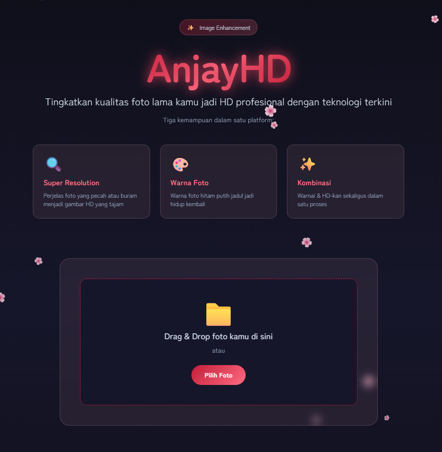
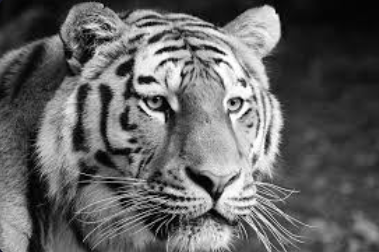
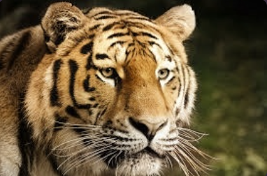

# ✨ AnjayHD - Image Enhancement

<p align="center">
  
  
  
  
</p>

<p align="center">
  
</p>

---

## 🌸 Tentang AnjayHD

AnjayHD adalah aplikasi web berbasis AI untuk meningkatkan kualitas foto dengan teknologi modern. Ubah foto lama yang buram, pecah, atau hitam putih menjadi gambar HD profesional dengan mudah.

---

## 🚀 Fitur Utama

### 1. 🔍 Super Resolution
Perjelas foto yang pecah atau buram menjadi gambar HD yang tajam menggunakan teknologi AI upscaling.

| Sebelum | Sesudah |
|:-------:|:-------:|
|  |  |

**Hasil:** Foto buram menjadi tajam dengan detail yang terjaga hingga 4x skala pembesaran.

---

### 2. 🎨 Pewarnaan Foto (Colorize)
Warna foto hitam putih jadul jadi hidup kembali dengan teknologi AI colorization.

| Sebelum (BW) | Sesudah (Warna) |
|:------------:|:---------------:|
|  |  |

**Hasil:** Foto hitam putih otomatis diwarnai dengan akurat.

---

### 3. ✨ Kombinasi (Both)
Warnai & HD-kan sekaligus dalam satu proses untuk hasil maksimal.

| Sebelum | Sesudah |
|:-------:|:-------:|
|  |  |

**Hasil:** Foto lama hitam putih menjadi HD berwarna.

---

## 📊 Perbandingan Skala

| Skala 2x | Skala 4x |
|:--------:|:--------:|
| Cepat, hasil baik | HD Max, detail penuh |
| Cocok untuk preview | Cocok untuk hasil akhir |

---

## 🛠️ Instalasi

### Prerequisites
- Python 3.8+
- Windows dengan GPU (opsional untuk kecepatan)

### Steps

```bash
# Clone repository
git clone [https://github.com/aliridwan15/AnjayHD-ImageEnhancement.git](https://github.com/aliridwan15/AnjayHD-ImageEnhancement.git)
cd anjayhd

# Install dependencies
pip install -r requirements.txt

# Jalankan aplikasi
python app.py
